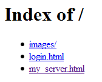

Appache 指令
============

``AddType``
-----------

* 描述：将指定后缀映射为特定媒体类型
* 语法： ``AddType media-type extension [extension] ...``
* 应用场合：server config, virtual host, directory, .htacess
* 覆盖：FileInfo
* 模块：mod_mime

``AddType`` 将指定文件后缀映射为指定媒体类型；
如果该后缀已经指定了媒体类型，则修改为新的类型。

推荐使用 ``AddType`` 指令修改后缀对应的媒体类型，而不是修改 ``TypeConfig`` 指定的文件。

.. note:: 默认为 ``TypeConfig conf/mime.types``

例如：

.. code-block:: html

 AddType image/jpeg jpeg jpg jpe

参数 ``extension`` 可以省略 ``.``。
文件名可能有多个扩展名，``extension`` 会一一进行比较。

给参数 ``media-type`` 一个 qs 值，可以实现 ``LanguagePriority`` （内容协商）相似的效果。

``AddType application/rss+xml;qs=0.8 .xml``

它针对某些情况，比如客户端的 ``Accept`` 头是 ``*/*``，不知如何处理响应内容。

.. note:: ``AddType`` 指令只能修改文件系统中的文件的媒体类型。
 无法修改由服务器产生的资源的媒体类型，例如服务器产生的 HTML 响应消息。

``AddHandler``
--------------

* 描述：将文件名后缀对应指定的解析器
* 语法：``AddHandler hanle-name extension [extension] ...``
* 应用场合：server config, virtual host, directory, .htacess
* 覆盖：FileInfo
* 模块：mod_mime

文件若带有后缀 ``extension``，则服务器会用指定的解析器解析该文件。
如果该后缀已经对应了解析器，则修改为新的解析器。
例如，``AddHandler cgi-script .cgi``。
任意带有 ``.cgi`` 后缀的文件都被当成 cgi 脚本。

.. note:: 这里有个前提，就是 ``.cgi`` 文件所处的目录必须设置了 ``Options ExecCGI``。

``extension`` 参数不区分大小写，可以省略 ``.``。
如果文件名有多个扩展名，则 ``extension`` 会一一进行比较。

``AddOutputFilter``
-------------------

将指定后缀的文件交给服务器过滤器进行处理，处理完之后再将结果传给客户端。
格式为：``AddOutputFilter filter[;filter...] extension [extension] ...``。

例如：

.. code-block:: html

 AddOutputFilter INCLUDES;DEFLATE shtml

将 ``.shtml`` 文件中的 ``SSI`` 指令进行处理，再用 ``mod_deflate`` 做压缩。

``MultiViewsMatch``
-------------------

* 描述：``MultiViews`` 搜索匹配一个文件，加载文件的类型。
* 语法：``MultiViewsMatch Any|NegotiationOnly|Filters|handlers [handlers|Filters]``

``MultiViewsMatch`` 在进行 ``mod_negotiation`` 的 ``MultiViews`` 搜索时，存在三种不同的行为。
在请求文件 ``index.html`` 时允许匹配任何协商后缀满足基本请求的文件，如 ``index.html.en``, ``index.html.fr``。

``Options``
-----------

* 描述：配置目录特性
* 语法：``Options [+|-] option [[+|-] option] ...``
* 默认：``Options FollowSymlinks``
* 应用场合：server config, virtual host, directory, .htacess
* 覆盖：Options
* 模块：``core``

+----------------------+----------------------------------------------------------------+---------------------+
| ``option``           | description                                                    | 执行模块            |
+======================+================================================================+=====================+
| None                 | 无                                                             | ``-----``           |
+----------------------+----------------------------------------------------------------+---------------------+
| All                  | 除 ``MutiViews`` 之外的所有选项                                | ``-----``           |
+----------------------+----------------------------------------------------------------+---------------------+
| ExecCGI              | 允许运行 ``CGI`` 脚本                                          | ``mod_cgi``         |
+----------------------+----------------------------------------------------------------+---------------------+
| FollowSymlinks       | 该目录下服务器使用符号链接 [1]_                                | ``-----``           |
+----------------------+----------------------------------------------------------------+---------------------+
| Includes             | 允许 :ref:`SSI<server_side_includes>`                          | ``mod_include``     |
+----------------------+----------------------------------------------------------------+---------------------+
| IncludesNOEXEC       | 允许 :ref:`SSI<server_side_includes>`；                        | ``-----``           |
|                      | 禁用 ``exec cmd`` 和 ``exec cgi`` 指令                         |                     |
+----------------------+----------------------------------------------------------------+---------------------+
| Indexes              | url 对应目录下若没有资源列表文件(如 ``index.html``)，          | ``mod_autoindex``   |
|                      | 模块 ``mod_autoindex`` 会返回该目录下所有文件和目录的列表 [2]_ |                     |
+----------------------+----------------------------------------------------------------+---------------------+
| MutiViews            | 允许内容协商的 ``MutiViews`` 选项                              | ``mod_negotiation`` |
+----------------------+----------------------------------------------------------------+---------------------+
| SymLinksIfOwnerMatch | 允许特定用户身份下，服务器访问该用户拥有的文件/目录时，        | ``-----``           |
|                      | 只使用符号链接                                                 |                     |
+----------------------+----------------------------------------------------------------+---------------------+

正常情况下，如果多个 ``Options`` 指令都应用于同一个目录，则只有一个生效，其余的会被忽略；选项不进行合并。
如果所有 ``Options`` 指令中的选项都跟一个 ``+`` 或者 ``-``，则选项会做合并。
有 ``+`` 的选项强制加入到现有选项中，而有 ``-`` 的选项则被剔除出当前的选项配置。

用 ``+`` 的好处是将一个 ``Options`` 长指令拆分为多个 ``Options`` 短指令。

.. warning:: ``+-`` 是非法的

举例说明：

.. code-block:: html
 
 <Directory "/web/docs">
     Options Indexes FollowSymlinks
 </Directory>

 <Directory "/web/docs/spec">
     Options Includes
 </Directory>

则只有针对目录 ``/web/docs/spec`` 的 ``Includes`` 会生效。

.. code-block:: html
 
 <Directory "/web/docs">
     Options Indexes FollowSymlinks
 </Directory>

 <Directory "/web/docs/spec">
     Options +Includes -Indexes
 </Directory>

即为 ``/web/docs/spec`` 目录设置了 ``FollowSymlinks`` 和 ``Includes``。

.. _script_alias:

``ScriptAlias``
---------------

* 描述：将 url 映射为某个目录下的 cgi 脚本
* 语法：``ScriptAlias URL-path file-path|directory-path``
* 适应范围：server config, virtual host
* 模块：mod_alias

``ScriptAlias`` 和 ``Alias`` 的行为相似。
不同之处是 ``ScriptAlias`` 标记的目录文件会被 ``mod_cgi`` 模块的解析器解析。

``ScriptAlias`` 指令有两个参数：

* 若参数 2 为 ``directory-path``（以 ``/`` 结尾），则以参数 1 为 url 路径的请求，会被映射成该目录下的脚本。
  例如 ``ScriptAlias /cgi-bin/ "F:/web/scripts/"``，对于 ``http://<hostname>/cgi-bin/foo``，会被映射为 ``F:/web/scripts/foo``。
* 若参数 2 为 ``file-path``（不以 ``/`` 结尾），则指定了一个自定义的脚本解析器。
  例如 ``ScriptAlias /cgi-bin/ "F:/web/self_definite_handle.py"``，
  则对于 ``http://<hostname>/cgi-bin/foo`` 请求，会映射为 ``F:/web/foo``，通过 ``"F:/web/self_definite_handle.py"`` 解析该脚本。

例如：``ScriptAlias /cgi-bin/ "F:/my_cgi_bin/"``，它等价于：

.. code-block:: html

 <Directory "F:/my_cgi_bin">
    SetHandler cgi-script
    Options ExecCGI
 </Directory>

.. note:: 
 不要将 cgi 脚本放在 ``DocumentRoot`` 目录下。
 不然一旦去掉 ``cgi-script`` 解析器配置 [3]_，浏览器可以直接获取脚本代码。

``SetHandler``
--------------

* 描述：对匹配的文件都用解析器处理
* 语法：``SetHandler handle-name|None``
* 应用场合：server config, virtual host, directory, .htacess
* 覆盖：FileInfo
* 模块：core

如果把 ``SetHandler`` 放在 ``.htacess`` 文件中或者 ``<Directory>`` / ``<Location>`` 节点中，
则所有匹配的文件都由 ``handle-name`` 指定的解析器解析。
例如在某个目录下设置：

``SetHandler imap-file``

则该目录下的所有文件都用 ``imap-file`` 解析。

如果想通过 ``http://servername/status`` 获取服务器的状态，则可以这样：

.. code-block:: html

 <Location "/status">
     SetHandler server-status
 </Location>

你也可以通过这个指令设置特定后缀文件对应的解析器。
如：

.. code-block:: html

 <FilesMatch \.php$>
     SetHandler application/x-httpd-php
 </FilesMatch>

.. note:: ``SetHandler`` 会改写默认的解析器。
 一些正常的行为会被抑制，比如 url 以 ``/`` 结尾表示获取目录的索引文件或资源列表。

.. [1] 尽管服务器使用符号链接，但匹配 ``<Directory>`` 节点的路径名不会改变。
       ``FollowSymlinks`` 和 ``SymLinksIfOwnerMatch`` 只能用在 ``<Directory>`` 或者 ``.htacess`` 文件中。
       省略这些选项也不是一个安全策略，因为导致服务器宕机的恶性竞争会影响符号链接测试。
.. [2] 如图：

.. [3] 取消掉 ``Options`` 的 ``ExecCGI`` 选项就能让所有的 cgi 设置失效。
       比如 ``SetHandler cgi-script``, ``AddHandler cgi-script <extension list>`` 以及 ``ScriptAlias`` 指令。